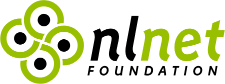
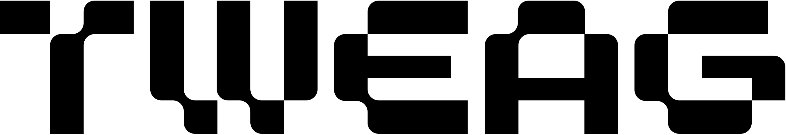

# Gomod2nix
Convert applications using Go modules -> Nix

## Usage
From the Go project directory execute:
``` bash
$ gomod2nix
```

This will create `gomod2nix.toml` that's used like so
``` nix
let
  pkgs = import <nixpkgs> {
    overlays = [
      (self: super: {
        buildGoApplication = super.callPackage ./builder { };
      })
    ];
  };
in pkgs.buildGoApplication {
  pname = "gomod2nix-example";
  version = "0.1";
  src = ./.;
  modules = ./gomod2nix.toml;
}
```

For more in-depth usage check the [Getting Started](./docs/getting-started.md) and the [Nix API reference](./docs/nix-reference.md) docs.

## Private modules

To use private Go modules that require authentication, provide a `netrcFile` parameter:

```nix
pkgs.buildGoApplication {
  pname = "my-app";
  version = "0.1";
  src = ./.;
  modules = ./gomod2nix.toml;
  netrcFile = ./secrets/netrc;  # Path to your netrc file
}
```

The netrc file uses standard format:
```
machine proxy.example.com
  login myuser
  password mytoken
```

You can also set `GOPROXY` when running nix-build to use a custom proxy:
```bash
GOPROXY="https://proxy.example.com" nix-build
```

## Avoiding IFD when pwd is a derivation

If `pwd` points to a derivation output (e.g., from `pkgs.lib.fileset.toSource`), reading `go.mod` from it causes Import From Derivation (IFD). To avoid this, use the `goModFile` parameter with a raw path:

```nix
pkgs.buildGoApplication {
  pname = "my-app";
  pwd = derivationOutput + "/subdir";  # Derivation output
  src = filteredSrc;
  modules = ./gomod2nix.toml;
  goModFile = ./go.mod;  # Raw path - avoids IFD
}
```

## Motivation

The [announcement blog post](https://www.tweag.io/blog/2021-03-04-gomod2nix/) contains comparisons with other Go build systems for Nix and additional notes on the design choices made.

## License

This project is licensed under the MIT License. See the [LICENSE](LICENSE)
file for details.

## About the project
The developmentent of Trustix (which Gomod2nix is a part of) has been sponsored by [Tweag I/O](https://tweag.io/) and funded by the [NLNet foundation](https://nlnet.nl/project/Trustix) and the European Commission’s [Next Generation Internet programme](https://www.ngi.eu/funded_solution/trustix-nix/) through the NGI Zero PET (privacy and trust enhancing technologies) fund.




